# Hướng dẫn crack nessus
## 1. Cài đặt Nessus bằng CentOS 8  ##
- Tải xuống phiên bản Nessus mới nhất từ trang chủ  
[Nessus Download](https://www.tenable.com/downloads/nessus)
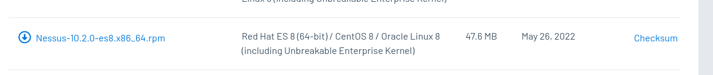
- Sau khi tải về sử dụng lệnh rpm để cài đặt  
```sh
sudo rpm -i Nessus-10.2.0-es8.x86_64.rpm
```
- Sau khi cài đặt xong khởi động service 
```sh
sudo service nessusd start
```
- Mở port web  
```sh
sudo firewall-cmd --zone=public --add-port=8834/tcp --permanent
sudo firewall-cmd --reload
```
- Mở trình duyệt và nhập địa chỉ 
``https://centos_ip:8834``
- Chọn **Managed Scanner** và **Continue**    
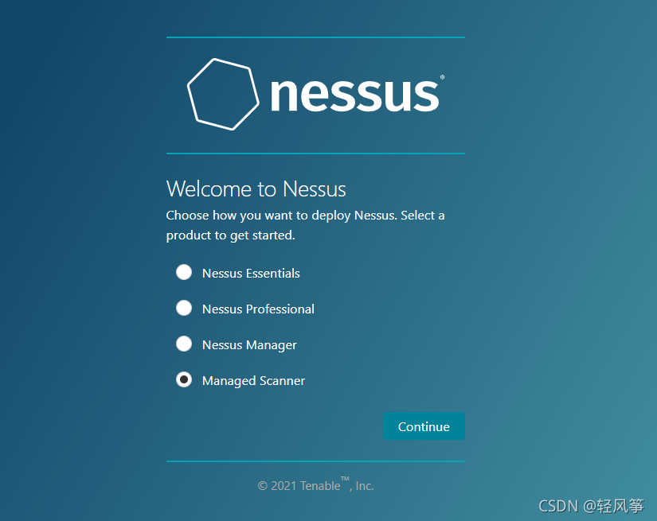
- Chọn **Tenable.sc** và **Continue**  
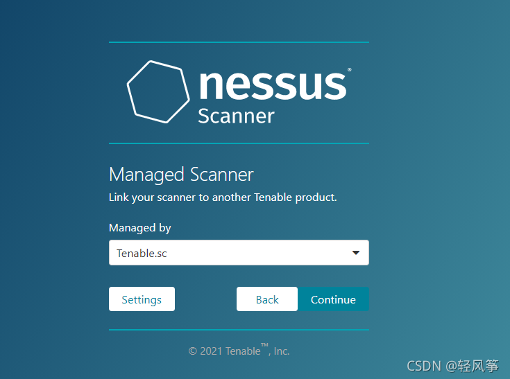
- Đặt tên người dùng và mật khẩu và **Submit**  
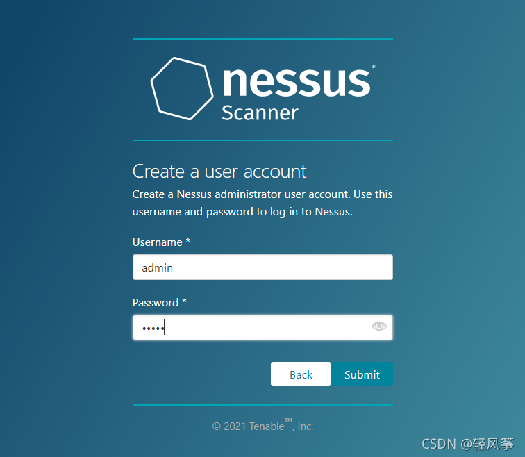
- Vào trang cài đặt Nessus.  
Tại thời điểm này Nessus vẫn chưa có chức năng scanner  
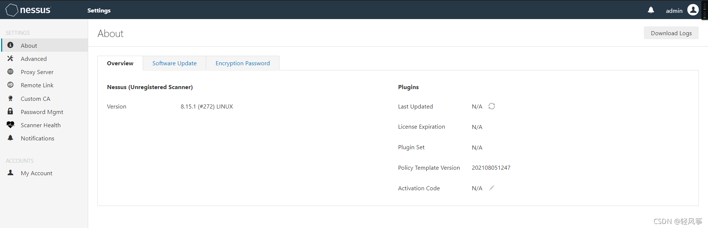
- Vào trang Nessus bên dưới để lấy mã kích hoạt.   
[Nessus key](https://www.tenable.com/products/nessus/nessus-essentials)
Tên có thể điền tùy ý, địa chỉ email phải chính xác để nhận mã kích hoạt (Có thể dùng mail 10p để nhận mã)  
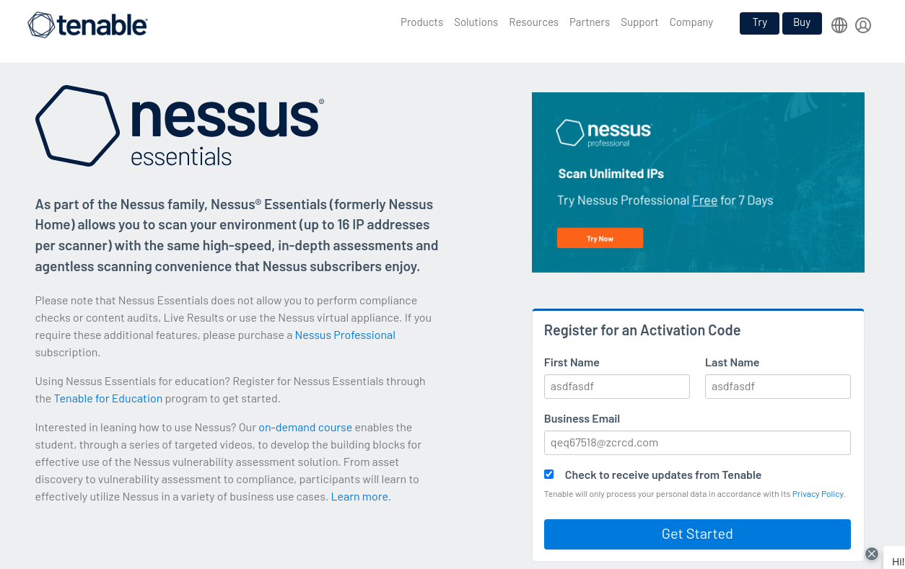
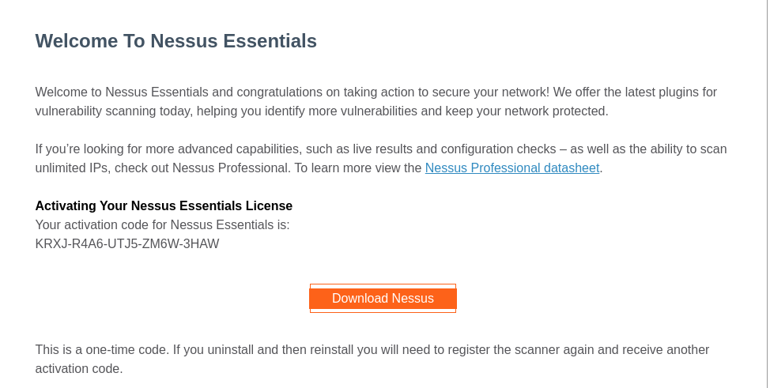
- Nhận mã kích hoạt Nessus  
```sh
sudo /opt/nessus/sbin/nessuscli fetch  --challenge
```
Kết quả như dưới  
```sh
sudo /opt/nessus/sbin/nessuscli fetch  --challenge
Challenge code: 7a4b83eb545842c3946c909514289df4ae18501c

You can copy the challenge code above and paste it alongside your
Activation Code at:
https://plugins.nessus.org/v2/offline.php
```
- Mở trình duyệt truy cập link https://plugins.nessus.org/v2/offline.php nhập mã license nhận từ mail và Challenge code ở phía trên  
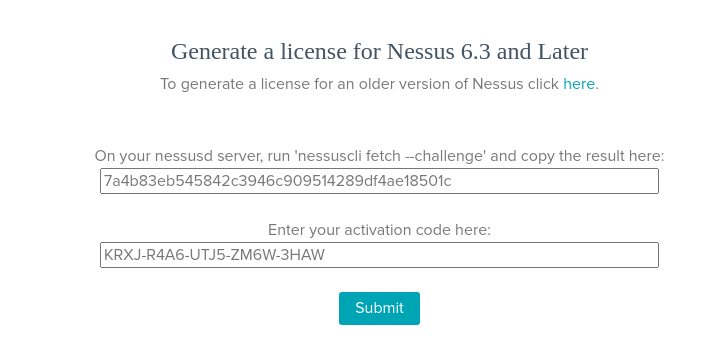
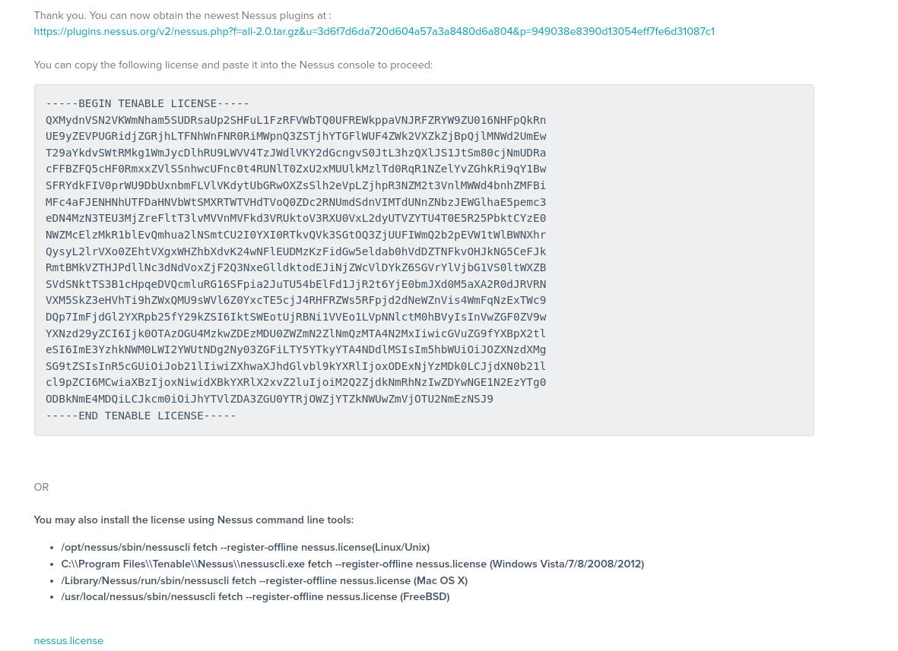
- Download plugin của Nessus và file nessus.license  
```sh
wget -O "all-2.0.tar.gz" "https://plugins.nessus.org/v2/nessus.php?f=all-2.0.tar.gz&u=3d6f7d6da720d604a57a3a8480d6a804&p=949038e8390d13054eff7fe6d31087c1"
wget -O "nessus.license" "https://plugins.nessus.org/v2/mkconfig.php?ac=3d6f7d6da720d604a57a3a8480d6a804949038e8390d13054eff7fe6d31087c1aa5ed07de4a4c9fca6d5e0fec9566a35"
```
- Cài đặt plugin.  
```sh
sudo /opt/nessus/sbin/nessuscli update ./all-2.0.tar.gz
```
- Kích hoạt Nessus ngoại tuyến  
```sh
sudo /opt/nessus/sbin/nessuscli fetch --register-offline ./nessus.license
```
- Sao chép thư mục plugins  
```sh
cp -r /opt/nessus/lib/nessus/plugins/ ./
```
- Khởi động lại service nessus  
```sh
sudo service nessusd restart
```
- Mở truy cập trình duyệt truy cập ``https://centos_ip:8834`` plugin sẽ được cài đặt mất khoảng 20-40 phút.  
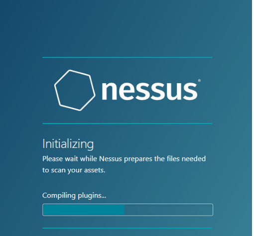
- Sau khi cài đặt xong đăng nhập hệ thống Nessus. Sẽ thấy kích hoạt thành công và chỉ cho phép scanner 16 IP.  
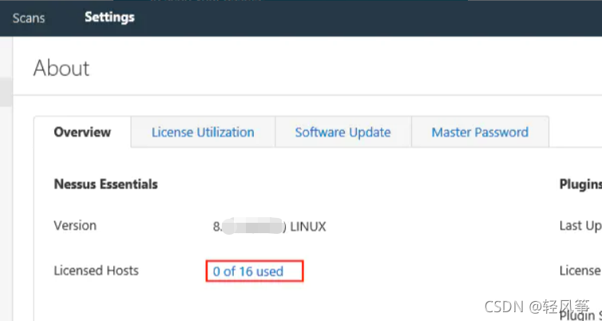
## 2. Crack Nessus ##
- Lấy phiên bản của plugin hiện tại, mở trang dưới và lưu lại số phiên bản  
https://plugins.nessus.org/v2/plugins.php  

- Tạo file **plugin_feed_info.inc**
```sh
vim plugin_feed_info.inc
```
- Nội dung như sau, và thay số trong nội dung sau bằng số phiên bản vừa lấy  
```sh
PLUGIN_SET = "202205310147";
PLUGIN_FEED = "ProfessionalFeed (Direct)";
PLUGIN_FEED_TRANSPORT = "Tenable Network Security Lightning";
```
- Thay thế plugin_feed_info.inc thành /opt/nessus/var/nessus/plugin_feed_info.inc  
```sh
sudo cp /root/plugin_feed_info.inc /opt/nessus/var/nessus/
```
- Xóa tệp /opt/nessus/lib/nessus/plugins/plugin_feed_info.inc.  
```sh
sudo rm -rf /opt/nessus/lib/nessus/plugins/plugin_feed_info.inc
```
- Khởi động lại service nessusd
```sh
sudo service nessusd restart
```
- Mở trình duyệt truy cập nessus sẽ thấy plugin cài đặt lại, sau khi hoàn thành truy cập trang setting sẽ không bị thấy giới hạn IP scanner.  
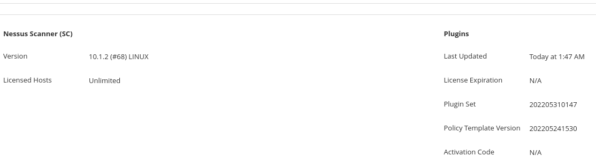
- **Chú ý**  
Vì plugin_feed_info.inc được đặt lại mỗi khi khởi động lại dịch vụ Nessus, tất cả các plugin trong thư mục nessus/plugins sẽ bị xóa và không thể quét được. Vì vậy, tắt service và disable service nessusd.  
```sh
sudo systemctl disable nessusd
sudo systemctl stop nessusd
```
- Sau mỗi lần khởi động lại nessus có thể viết script  
```sh
vim crack-nessus.sh
```
- Nội dung như sau  
```sh
service nessusd stop;
cp /root/plugin_feed_info.inc /opt/nessus/var/nessus/;
rm -rf /opt/nessus/lib/nessus/plugins/plugin_feed_info.inc;
service nessusd start;
```
- Ghi crack_nessus.sh vào tập lệnh khởi động hệ thống. Bằng cách này, mỗi khi khởi động lại CentOS, quy trình loại bỏ các hạn chế IP sẽ tự động được thực hiện.
```sh
sudo chmod +x  /etc/rc.d/rc.local
sudo vim  /etc/rc.d/rc.local
```
- Nội dung như sau   
```sh
/bin/bash /root/crack_nessus.sh
```
## 3. Các trường hợp có thể gặp phải ##

Trong quá trình dỡ bỏ hạn chế IP, nếu đã dỡ bỏ thành công nhưng khi tạo dự án quét mới, thấy rằng nó sẽ kết thúc sớm và không có kết quả quét. Tại thời điểm này, hãy kiểm tra xem nội dung của thư mục plugin đã bị xóa chưa.
```sh
sudo ls /opt/nessus/lib/nessus/plugins | wc -l
```
Trong trường hợp bình thường thu mục này có khoảng trên 145000. Nếu thấp hơn nhiều so với giá trị này làm theo các bước ở bên dưới (bắt buộc phải có thư mục plugin đã sao lưu).  
```sh
service nessusd stop;
rm -rf /opt/nessus/lib/nessus/plugins
cp -r ./plugins /opt/nessus/lib/nessus/
cp /root/plugin_feed_info.inc /opt/nessus/var/nessus/;
rm -rf /opt/nessus/lib/nessus/plugins/plugin_feed_info.inc;
service nessusd start;
```
- Sau đó mở trình duyệt và truy cập nessus bình thường. (https://centos_ip:8843). Chờ quá trình cập nhật plugin hoàn tất  


